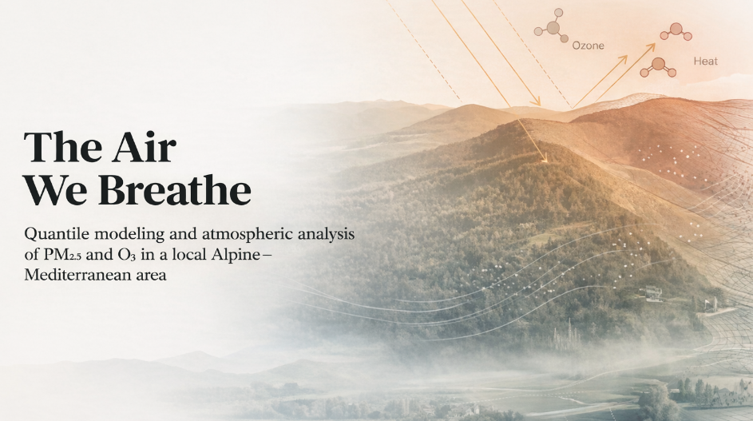
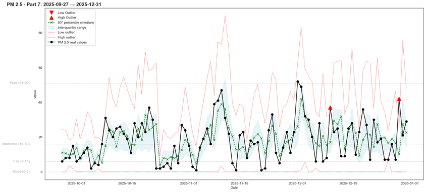
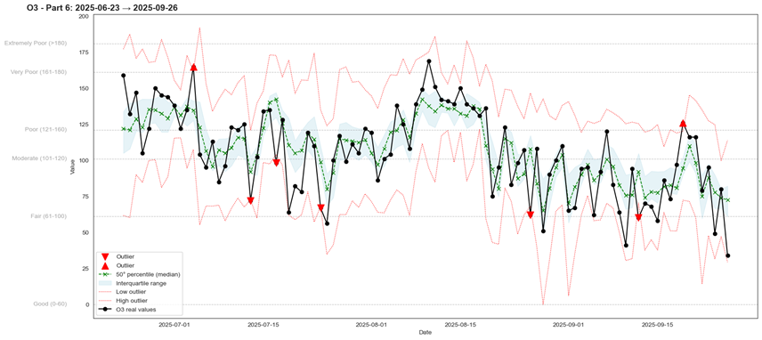

# The Air We Breathe



---

## Overview

This project applies data science and machine learning techniques to analyze and model air quality dynamics in the Val Lemme area, located at the transition between Piemonte and Liguria (Italy).

The dataset was collected daily over two years (2024–2025), combining manually recorded pollutant measurements with meteorological data from the ARPA Piemonte monitoring station "BRIC CASTELLARO". The objective is to understand how atmospheric conditions influence pollutant concentration and to develop predictive models capable of estimating pollution levels and their variability.

Rather than focusing on deterministic prediction alone, the project adopts a probabilistic approach using quantile regression, allowing estimation of expected concentration ranges and uncertainty intervals.

---

## Objectives

* Analyze temporal and statistical structure of PM2.5 and O₃ concentrations
* Identify meteorological regimes associated with pollutant accumulation or dispersion
* Model pollutant dynamics using quantile regression
* Estimate uncertainty intervals using interquartile range (IQR) modeling
* Classify air quality levels according to the European Air Quality Index (AQI)
* Interpret model behavior using feature importance and SHAP analysis

---

## Dataset

The dataset includes daily observations from January 2024 to December 2025 and integrates:

### Pollutants

* PM2.5
* PM10
* O₃
* NO₂
* SO₂

### Meteorological variables

* Temperature (min, avg, max)
* Humidity (min, avg, max)
* Wind speed, gust, and direction
* Precipitation (transformed into categorical rain classes)
* Daylight duration

Additional engineered features include:

* Lagged pollutant and weather variables
* Rolling means
* Weather regime classifications using clustering

---

## Methodology

The analysis follows a structured pipeline:

### Exploratory Data Analysis

Statistical analysis revealed:

* PM2.5 exhibits a strongly right-skewed distribution, with episodic extreme accumulation events
* O₃ displays strong seasonal dependence, increasing during warm and high-radiation periods
* Wind intensity negatively correlates with particulate concentration, confirming dispersion effects
* Temperature and daylight strongly influence ozone formation
* Pollutant concentrations exhibit significant temporal persistence

### Weather Regime Identification

Days were grouped into distinct weather types using K-Means clustering, enabling the models to capture atmospheric regimes favoring accumulation or dispersion.


### Feature Engineering

Features include:

* Lagged pollutant values
* Rolling averages
* Meteorological interactions
* Temporal and seasonal indicators

### Quantile Regression Modeling

CatBoost models were trained using quantile loss to estimate:

* Q1 (25th percentile)
* Median (50th percentile)
* Q3 (75th percentile)

This allows modeling both expected values and variability.

### Evaluation

Models were evaluated using:

* Pinball loss
* Confusion matrices mapped to EU AQI classes
* Temporal consistency analysis

### Model Interpretation

SHAP values were used to identify key drivers influencing pollutant concentrations.


---

## Key Findings

### PM2.5 dynamics

* Strong inverse relationship with temperature
* Higher concentrations during cold, calm atmospheric conditions
* Significant temporal persistence between consecutive days
* Good predictive accuracy across AQI classes

In the picture below it is showed how the model performs against a portion of the test data


### O₃ dynamics

* Strong seasonal dependence driven by temperature and daylight
* Higher levels during hot, dry, stable atmospheric regimes
* Greater variability during transitional seasons

### Meteorological influence

* Wind reduces particulate concentration through dispersion
* Humidity and precipitation modify pollutant variability
* Atmospheric circulation regimes influence pollutant accumulation patterns

In the picture below it is showed how the model performs against a portion of the test data


Overall, results demonstrate that pollutant dynamics are governed by structured atmospheric regimes rather than random fluctuations.

---

## Repository Structure

```text
the-air-we-breathe/
│
├── notebooks/
│   ├── The Air We Breathe - EDA.ipynb
│   └── The Air We Breathe - Modelling.ipynb
│
├── data/
│   ├── raw/
│   │
│   └── processed/
│       ├── data_orig.pkl
│       ├── data_full.pkl
│       ├── day_types.pkl
│       ├── kmeans_model.pkl
│       ├── pm_vals.pkl
│       ├── pm_classes.pkl
│       ├── o3_vals.pkl
│       └── o3_classes.pkl
│
├── images/
│   ├── day_types.png
│   ├── header.png
│   ├── o_3_test.png
│   ├── pm_2_5_test.png
│   └── shap_analysis.png
│
├── utils.py
│
└── README.md
```
---

## Skills Demonstrated

* Exploratory data analysis
* Feature engineering
* Quantile regression modeling
* Clustering and regime identification
* Time series feature engineering
* Machine learning interpretation (Shap)
* Environmental data analysis

---

## Author

Alessio Repetto

GitHub: [https://github.com/AlessioRepetto]

LinkedIn: [https://www.linkedin.com/in/alessio-repetto-75baa1333/]
